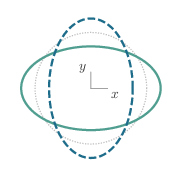
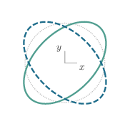
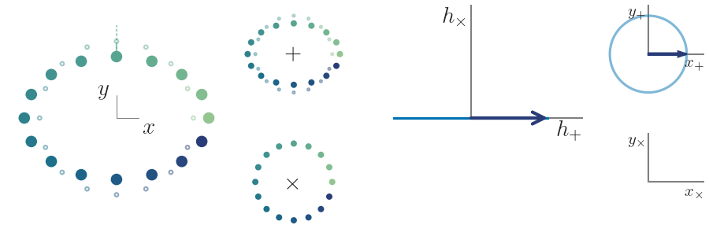



# Gravitational-wave polarizations

Like electromagnetic waves, gravitational waves (GWs) come in two distinct polarization states. These can be parametrized in a number of ways---we illustrate a few examples below.

## The linear basis

GW polarizations are usually represented in the **linear polarization basis** of plus ($$+$$) and cross ($$\times$$) states, which are typically illustrated by their instantaneous effect on a freely-falling ring of particles, as shown below.

<figure>

<figcaption>Plus (left) and cross (right) polarizations.</figcaption>
</figure>

In these figures, the GW propagates in the _z_ direction, in or out of the screen, deforming the original ring (dotted circle) into ellipsoidal patterns shown at half-period intervals (solid and dashed).

Any GW can be expressed as a superposition of these two polarization states, and can be specified through time-dependent strain functions $$h_+$$ and $$h_\times$$. These functions determine the signal observed at any given detector; for any specific source, they are determined by Einstein's equations and relevant initial conditions.

We can visualize how any GW can be decomposed into $$+$$ and $$\times$$ contributions by explicitly splitting the two polarizations and illustrating their physical effects separately.
More abstractly, we can also represent the GW polarization state at any instant through a vector in a Cartesian space defined by the $$\left(h_+, h_\times\right)$$ amplitudes.
If the wave is monochromatic (i.e., it has a definite frequency $$\omega$$), we can further represent the individual phases of each polarization component through so-called _linear quadratures_, $$x_{+/\times} \equiv A_{+/\times} \cos \phi_{+/\times} \cos \omega t$$ and $$y_{+/\times} \equiv A_{+/\times} \sin \phi_{+/\times} \sin \omega t$$.
An example of all these representations is shown in the figure below for the simple case of a fully $$+$$-polarized wave.

<figure>

<figcaption>Monochromatic plus polarized wave as a function of time.</figcaption>
</figure>

_Left:_ overall effect on a freely-falling ring of particles. _Center left:_ decomposition of the effect into $$+$$ (top) and $$\times$$ states; in this case, there is no $$\times$$ contribution. _Center right:_ polarization state represented in the $$h_+$$ vs $$h_\times$$ phasor space, where the arrow represents the amplitude of plus vs cross waves at any given instant. _Left_: decomposition into the cosine and sine quadratures defined by $$x_{+/\times} \equiv A_{+/\times} \cos \phi_{+/\times} \cos \omega t$$ and $$y_{+/\times} \equiv A_{+/\times} \sin \phi_{+/\times} \sin \omega t$$.

## The circular basis

For monochromatic GWs, just as in the case of electromagnetic waves, we can also define a **circular polarization basis**, composed of right and left handed modes.
These are defined such that they result in a polarization phasor that rotates around a circle in the $$\left(h_+, h_\times\right)$$ plane; if the rotation is counterclockwise (clockwise), we say the state is right-handed (left-handed).
In terms of the linear polarization amplitudes, the corresponding right (R) and left (L) handed polarization amplitudes, $$h_{R/L}$$, are given by

$$
h_{R/L} = \frac{1}{\sqrt{2}} \left( h_+ \mp h_\times \right)
$$

with the minus (plus) sign for R (L).

<figure>

<figcaption>Monochromatic right-handed wave as a function of time.</figcaption>
</figure>

